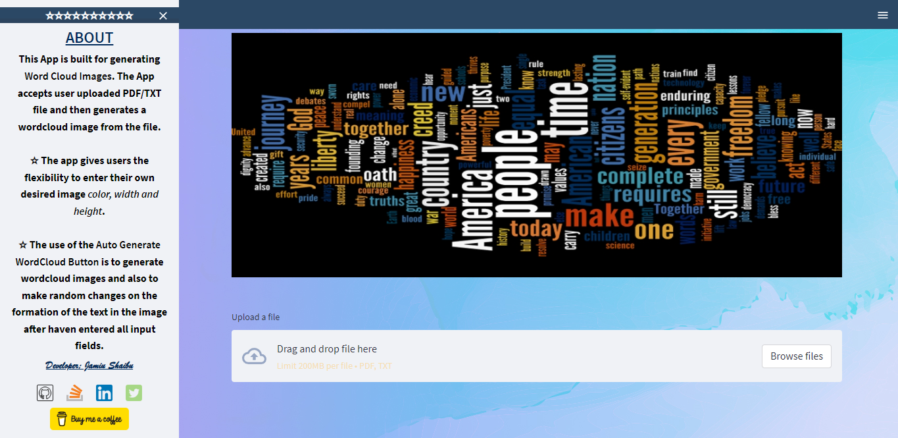
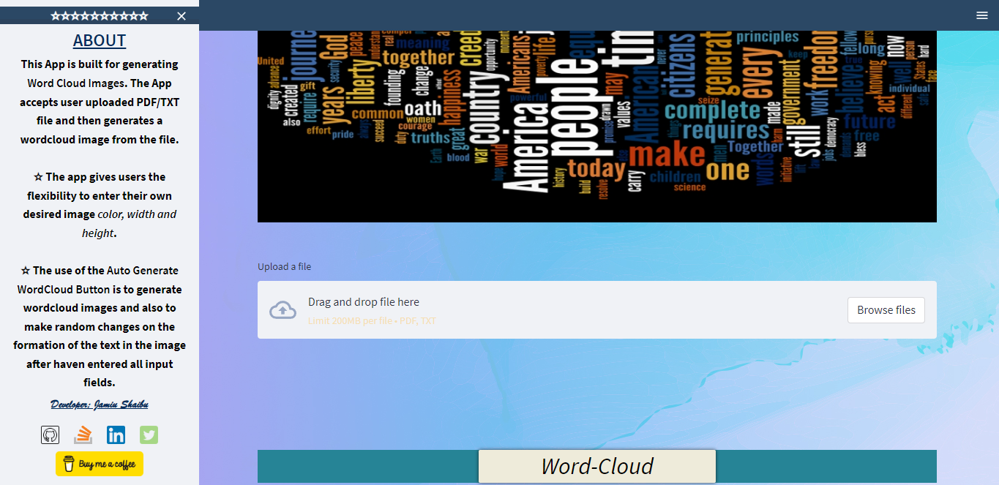
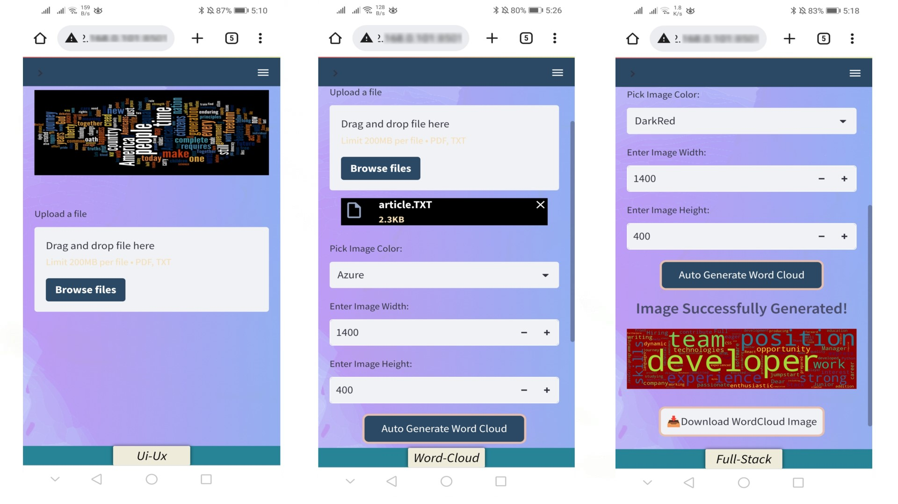
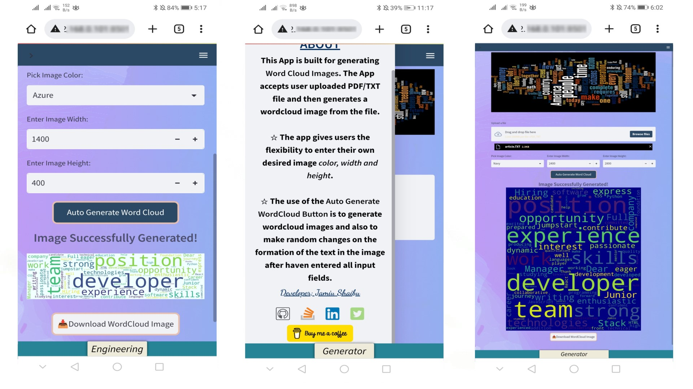

# Word Cloud Generator

### OVERVIEW:

This App is built for generating Word Cloud Images. 
The App allows user to upload a PDF, TXT or DOCX file which they can then generate 
images out of the uploaded file after haven entered all the input fields.

- The app gives users the flexibility to enter their own desired image 
color, width and height.

- The use of the Auto Generate WordCloud Button is to generate wordcloud 
images and also to make random changes on the formation of the text in the 
image after haven entered all input fields.

## Table of Contents

[//]: # (- [Licence]&#40;#licence&#41;)
- [General Info](#general-information)
- [Technologies Used](#technologies-used)
- [Screenshots](#screenshots)
- [Setup](#setup)
- [Project Status](#project-status)
- [Contact](#contact)

<!-- * [License](#license) -->

[//]: # (## Licence)

[//]: # (This project is open source. Personal logos and images should not be used without authorization.)

## General Information

- This project is built using Streamlit library

## Technologies Used

- Code Editor: Pycharm
- Google Chrome (browser)
- Git and GitHub

## Screenshots
### Desktop Screenshots

### Mobile Screenshot

## Setup

To navigate to the website use the following link:
[Word Cloud Generator](https://jamiushaibu-word-cloud-web-app-scriptsapp-home-dh110j.streamlit.app/)

You will find all the files and images which make up this website on this repository.

## Project Status

Completed

## Contact

Created by [Jamiu Shaibu](mailto:jamiushaibu12@gmail.com) - feel free to contact me!

[Buy me coffee](https://www.buymeacoffee.com/jamiushaib5)

[LinkedIn](https://www.linkedin.com/in/jamiu-shaibu-9037ba195/)

[Stackoverflow](https://stackoverflow.com/users/19290081/jamiu-shaibu)

